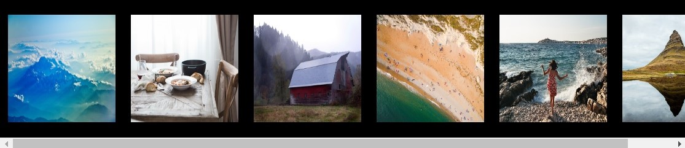
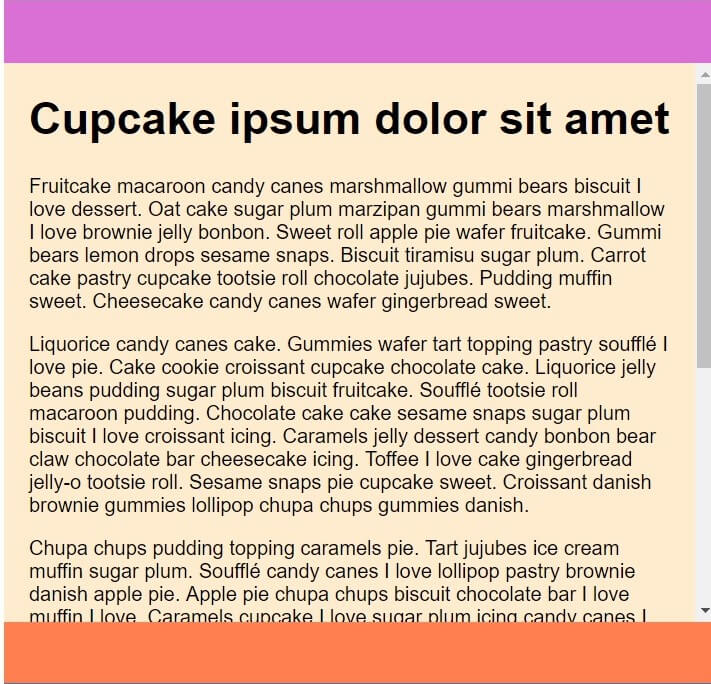

# Homework - Flexbox Shrink

> ### Setup
> Modify `package.json` so that the `source` variable points to:
> -  `08_Day_4_-_Homework/01_Flexbox_Shrink`
>
> **Remember that after each change in `package.json` you should stop Parcel (`CTRL+C`) and run it again (`npm start`).**

In `index.html` you will find a section named `flex-container`.

* Add display: flex property to its class and set a background. Make the flex direction horizontal.
* Next, inside the container, add several photos side by side so that their combined width is not less than 500px yet not greater than 1024px – the sizes of the photos should be the same.
* Align the photos so that they are centered in relation to the height of the container.
* Add appropriate properties to the container and to the photos in a way that photos do not shrink when the browser window is shrunk, but scroll.
* The use of `overflow` property will be necessary.

# Homework - Flexbox Grow Shrink

> ### Setup
> Modify `package.json` so that the `source` variable points to:
> -  `08_Day_4_-_Homework/02_Flexbox_Grow_Shrink`
>
> **Remember that after each change in `package.json` you should stop Parcel (`CTRL+C`) and run it again (`npm start`).**

> Enable responsive browser view and set the window to mobile width

In `index.html` you will find a section named `flex-container-column`.

* Add display: flex property with vertical orientation to its class and set the height to 100vh.
* Add three sections to the container: header, main and footer. Each of them should have a colorful background.
* Set any height you choose for the header and footer.
* Add several paragraphs to the main section.
* Using the property of flex-box set the header and footer in a way that they are always visible in the browser window – they should stick to the top and bottom of the window appropriately.
* Add appropriate properties so that the text in the middle section could be scrolled when browser window height is decreased.
* The use of `overflow` property will be necessary.

